# Echarts

## 概述

ECharts是由百度前端团队开发的一款开源的基于js图形报表组件，一个使用 JavaScript 实现的开源可视化库，可以流畅的运行在 PC 和移动设备上，兼容当前绝大部分浏览器（IE8/9/10/11，Chrome，Firefox，Safari等），底层依赖轻量级的矢量图形库 ZRender，提供直观，交互丰富，可高度个性化定制的数据可视化图表。


地址：https://echarts.apache.org/zh/index.html


## 特性

* 丰富的可视化类型
* 多种数据格式无需转换直接使用
* 千万数据的前端展现
* 移动端优化
* 多渲染方案，跨平台使用！
* 深度的交互式数据探索
* 多维数据的支持以及丰富的视觉编码手段
* 动态数据
* 绚丽的特效


## 下载和安装

npm安装：

```sh
npm install echarts
```


cdn方式：

可以从以下免费 CDN 中获取和引用 ECharts。

* jsDelivr：https://www.jsdelivr.com/package/npm/echarts
* unpkg：https://unpkg.com/browse/echarts/
* cdnjs：https://cdnjs.com/libraries/echarts


[apache/echarts](https://github.com/apache/echarts) 项目的 [release](https://github.com/apache/echarts/releases) 页面可以找到各个版本的链接。点击下载页面下方 Assets 中的 Source code，解压后 `dist` 目录下的 `echarts.js` 即为包含完整 ECharts 功能的文件。


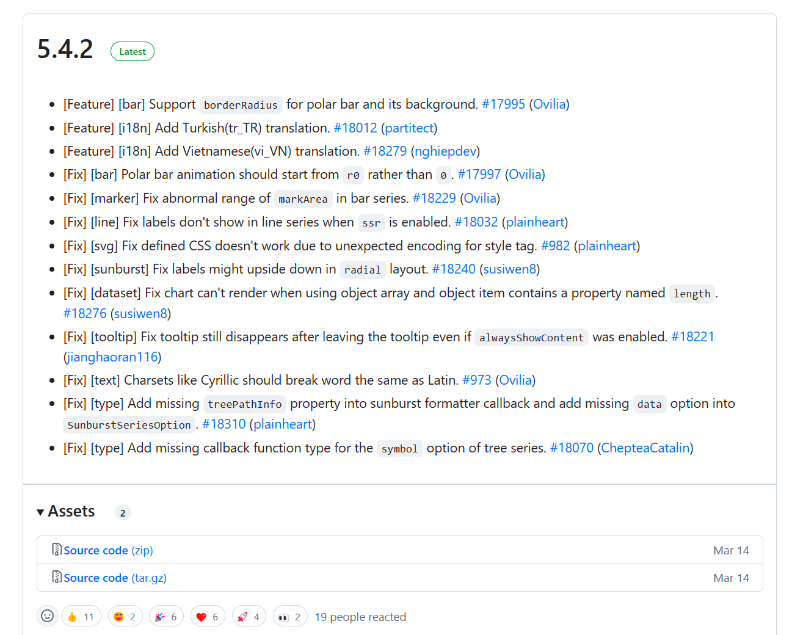


https://github.com/apache/echarts/archive/refs/tags/5.4.2.zip


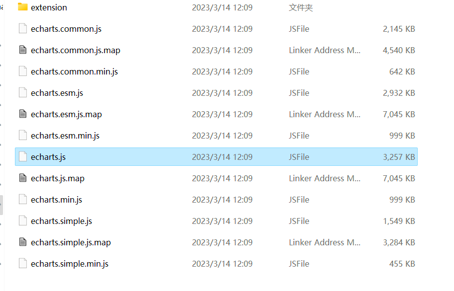


也可以定制：https://echarts.apache.org/zh/builder.html


## 官方文档和示例

文档：https://echarts.apache.org/handbook/zh/get-started/

API文档：https://echarts.apache.org/zh/api.html#echarts

示例：https://echarts.apache.org/examples/zh/index.html


## 折线图

### 基础折线图

将下载完的的js文件放入项目目录：

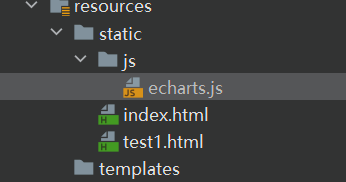


```html
<html lang="en">
<head>
    <meta charset="UTF-8">
    <title>基础折线图</title>

    <script src="./js/echarts.js"></script>

</head>

<style>
    #container {
        width: 70vw;
        height: 70vh;
        position: absolute;
        top: 50%;
        left: 50%;
        transform: translate(-50%, -50%);
    }
</style>
<body>
<div id="container"></div>
<script>
    //初始化echarts实例
    var chart = echarts.init(document.getElementById('container'));

    // 指定图表的配置项和数据
    var option =
        {
            xAxis: {
                type: 'category',
                data: (function ()
                {
                    var data = [];
                    for (let i = 1; i < 11; i++)
                    {
                        data.push("" + i);
                    }
                    return data;
                }())
            },
            yAxis: {
                type: 'value'
            },
            series: [
                {
                    data: (function ()
                    {
                        var data = [];
                        for (let i = 1; i < 11; i++)
                        {
                            data.push(Math.random() * 10 + 5);
                        }
                        return data;
                    }()),
                    type: 'line'
                }
            ]
        };

    //使用刚指定的配置项和数据显示图表
    chart.setOption(option);

</script>

</body>
</html>
```


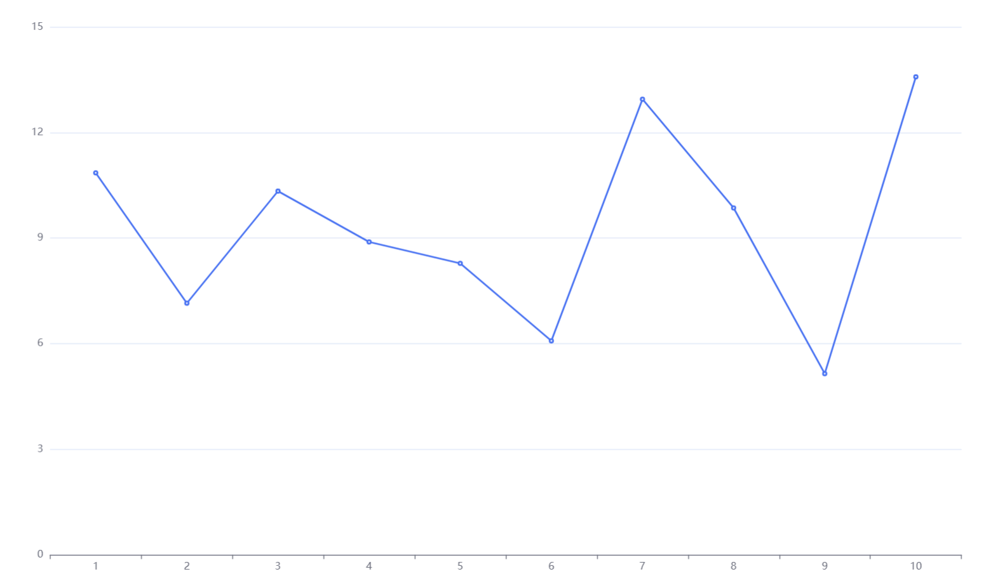


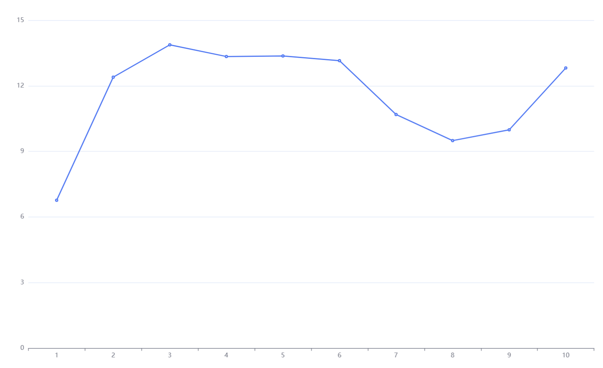


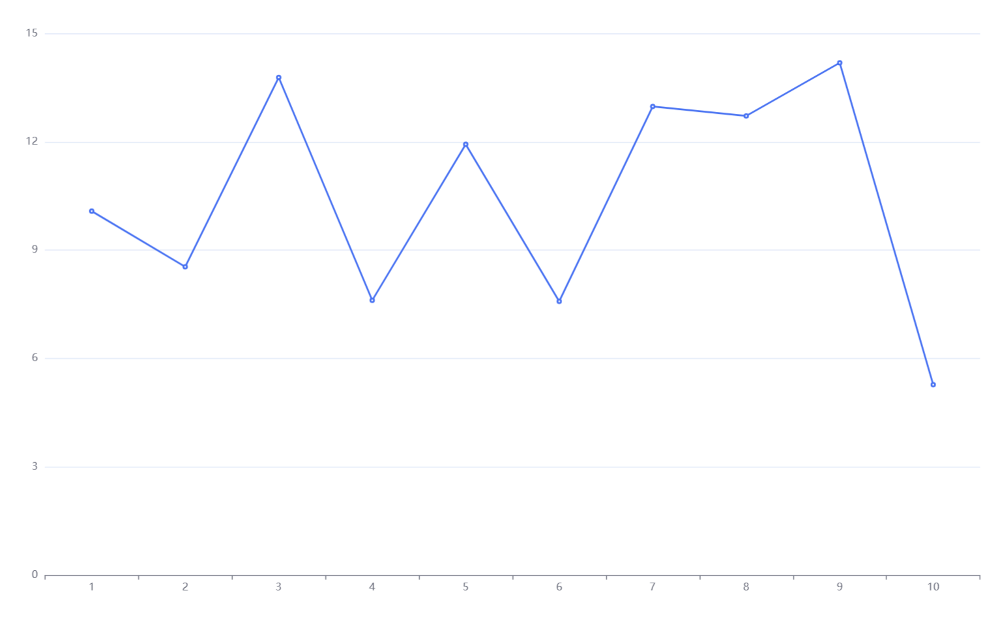


### 平滑折线图

```html
<html lang="en">
<head>
    <meta charset="UTF-8">
    <title>平滑折线图</title>

    <script src="./js/echarts.js"></script>

</head>

<style>
    #container {
        width: 70vw;
        height: 70vh;
        position: absolute;
        top: 50%;
        left: 50%;
        transform: translate(-50%, -50%);
    }
</style>
<body>
<div id="container"></div>
<script>
    //初始化echarts实例
    var chart = echarts.init(document.getElementById('container'));

    // 指定图表的配置项和数据
    var option =
        {
            xAxis: {
                type: 'category',
                data: (function ()
                {
                    var data = [];
                    for (let i = 1; i < 11; i++)
                    {
                        data.push("" + i);
                    }
                    return data;
                }())
            },
            yAxis: {
                type: 'value'
            },
            series: [
                {
                    data: (function ()
                    {
                        var data = [];
                        for (let i = 1; i < 11; i++)
                        {
                            data.push(Math.random() * 10 + 5);
                        }
                        return data;
                    }()),
                    type: 'line',
                    smooth: true,
                },
            ]
        };

    //使用刚指定的配置项和数据显示图表
    chart.setOption(option);

</script>

</body>
</html>

```


添加`smooth: true,`


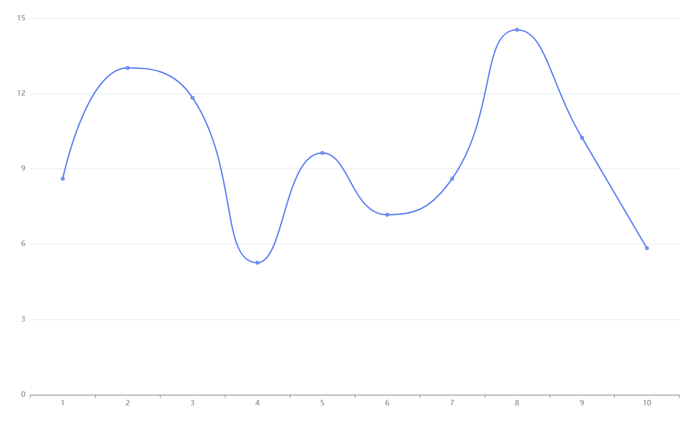


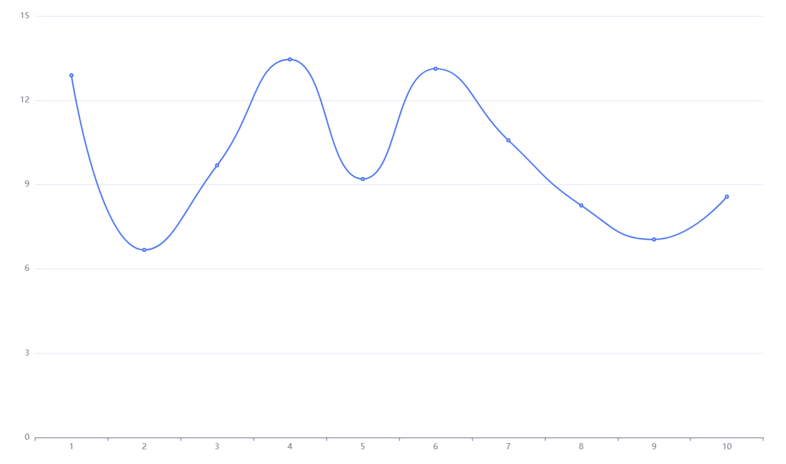


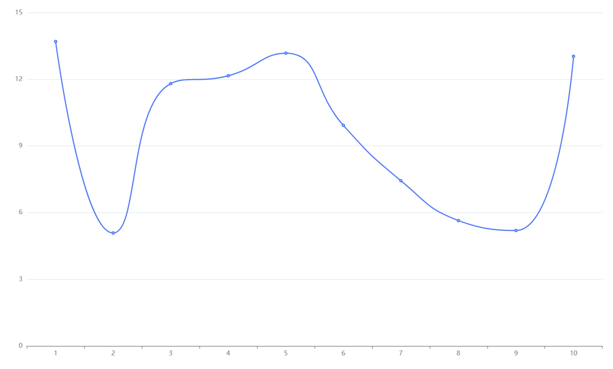


### 堆叠折线图

```html
<html lang="en">
<head>
    <meta charset="UTF-8">
    <title>堆叠折线图</title>

    <script src="./js/echarts.js"></script>

</head>

<style>
    #container {
        width: 70vw;
        height: 70vh;
        position: absolute;
        top: 50%;
        left: 50%;
        transform: translate(-50%, -50%);
    }
</style>
<body>
<div id="container"></div>
<script>
    //初始化echarts实例
    var chart = echarts.init(document.getElementById('container'));

    // 指定图表的配置项和数据
    var option =
        {
            xAxis: {
                type: 'category',
                data: (function ()
                {
                    var data = [];
                    for (let i = 1; i < 11; i++)
                    {
                        data.push("" + i);
                    }
                    return data;
                }())
            },
            legend:
                {
                    data: ["折线1", "折线2", "折线3"]
                },
            yAxis: {
                type: 'value'
            },
            tooltip: {
                trigger: 'axis'
            },
            series: [
                {
                    data: (function ()
                    {
                        var data = [];
                        for (let i = 1; i < 11; i++)
                        {
                            data.push(Math.random() * 10 + 5);
                        }
                        return data;
                    }()),
                    type: 'line',
                    smooth: false,
                    name: "折线1"
                },
                {
                    data: (function ()
                    {
                        var data = [];
                        for (let i = 1; i < 11; i++)
                        {
                            data.push(Math.random() * 10 + 5);
                        }
                        return data;
                    }()),
                    type: 'line',
                    smooth: false,
                    name: "折线2"
                },
                {
                    data: (function ()
                    {
                        var data = [];
                        for (let i = 1; i < 11; i++)
                        {
                            data.push(Math.random() * 10 + 5);
                        }
                        return data;
                    }()),
                    type: 'line',
                    smooth: true,
                    name: "折线3"
                },
            ]
        };

    //使用刚指定的配置项和数据显示图表
    chart.setOption(option);

</script>

</body>
</html>
```


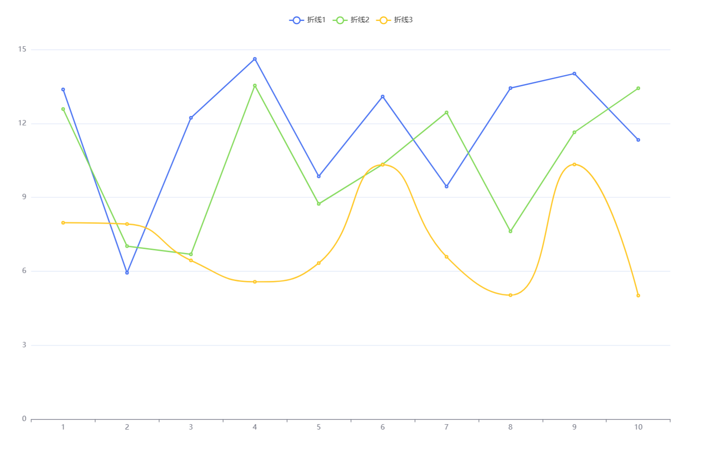


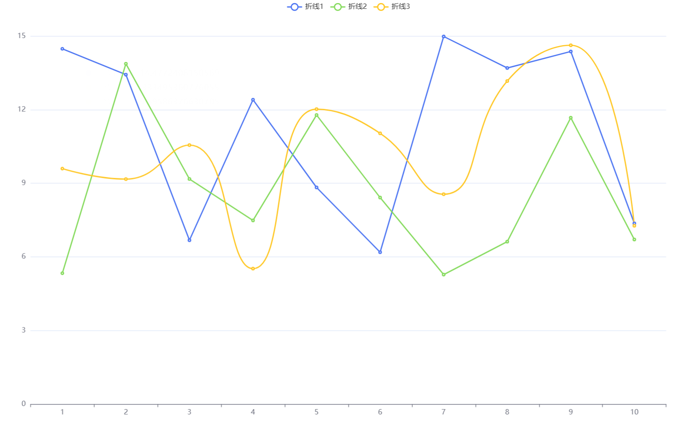


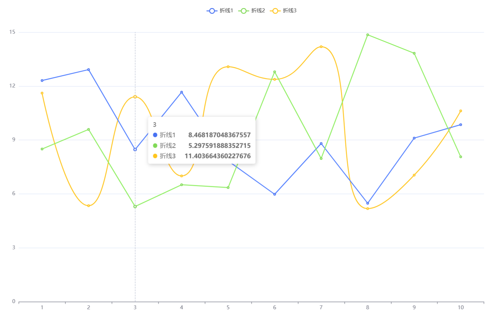


```html
<html lang="en">
<head>
    <meta charset="UTF-8">
    <title>堆叠折线图</title>

    <script src="./js/echarts.js"></script>

</head>

<style>
    #container {
        width: 70vw;
        height: 70vh;
        position: absolute;
        top: 50%;
        left: 50%;
        transform: translate(-50%, -50%);
    }
</style>
<body>
<div id="container"></div>
<script>
    //初始化echarts实例
    var chart = echarts.init(document.getElementById('container'));

    // 指定图表的配置项和数据
    var option =
        {
            title: {
                text: 'Stacked Line'
            },
            tooltip: {
                trigger: 'axis'
            },
            legend: {
                data: ['Email', 'Union Ads', 'Video Ads', 'Direct', 'Search Engine']
            },
            grid: {
                left: '3%',
                right: '4%',
                bottom: '3%',
                containLabel: true
            },
            toolbox: {
                feature: {
                    saveAsImage: {}
                }
            },
            xAxis: {
                type: 'category',
                boundaryGap: false,
                data: ['Mon', 'Tue', 'Wed', 'Thu', 'Fri', 'Sat', 'Sun']
            },
            yAxis: {
                type: 'value'
            },
            series: [
                {
                    name: 'Email',
                    type: 'line',
                    stack: 'Total',
                    data: [120, 132, 101, 134, 90, 230, 210]
                },
                {
                    name: 'Union Ads',
                    type: 'line',
                    stack: 'Total',
                    data: [220, 182, 191, 234, 290, 330, 310]
                },
                {
                    name: 'Video Ads',
                    type: 'line',
                    stack: 'Total',
                    data: [150, 232, 201, 154, 190, 330, 410]
                },
                {
                    name: 'Direct',
                    type: 'line',
                    stack: 'Total',
                    data: [320, 332, 301, 334, 390, 330, 320]
                },
                {
                    name: 'Search Engine',
                    type: 'line',
                    stack: 'Total',
                    data: [820, 932, 901, 934, 1290, 1330, 1320]
                }
            ]
        };

    //使用刚指定的配置项和数据显示图表
    chart.setOption(option);

</script>

</body>
</html>
```


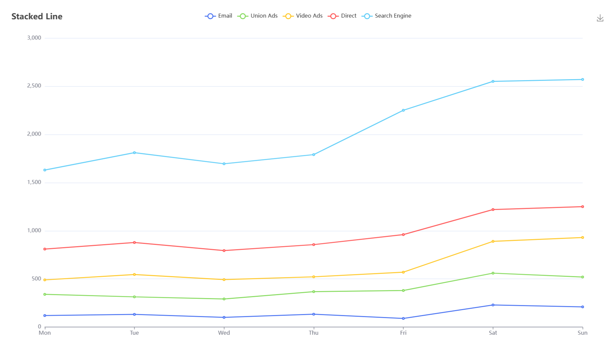


### 多x轴折线图

```html
<html lang="en">
<head>
    <meta charset="UTF-8">
    <title>多x轴折线图</title>

    <script src="./js/echarts.js"></script>

</head>

<style>
    #container {
        width: 70vw;
        height: 70vh;
        position: absolute;
        top: 50%;
        left: 50%;
        transform: translate(-50%, -50%);
    }
</style>
<body>
<div id="container"></div>
<script>
    //初始化echarts实例
    var chart = echarts.init(document.getElementById('container'));


    const colors = ['red', 'blue'];
    // 指定图表的配置项和数据
    var option =
        {
            color: colors,
            tooltip: {
                trigger: 'none',
                axisPointer: {
                    type: 'cross'
                }
            },
            legend: {},
            grid: {
                top: 70,
                bottom: 50
            },
            xAxis: [
                {
                    type: 'category',
                    axisTick: {
                        alignWithLabel: true
                    },
                    axisLine: {
                        onZero: false,
                        lineStyle: {
                            color: colors[1]
                        }
                    },
                    axisPointer: {
                        label: {
                            formatter: function (params)
                            {
                                return (
                                    'Precipitation  ' +
                                    params.value +
                                    (params.seriesData.length ? '：' + params.seriesData[0].data : '')
                                );
                            }
                        }
                    },
                    // prettier-ignore
                    data: ['2016-1', '2016-2', '2016-3', '2016-4', '2016-5', '2016-6', '2016-7', '2016-8', '2016-9', '2016-10', '2016-11', '2016-12']
                },
                {
                    type: 'category',
                    axisTick: {
                        alignWithLabel: true
                    },
                    axisLine: {
                        onZero: false,
                        lineStyle: {
                            color: colors[0]
                        }
                    },
                    axisPointer: {
                        label: {
                            formatter: function (params)
                            {
                                return (
                                    'Precipitation  ' +
                                    params.value +
                                    (params.seriesData.length ? '：' + params.seriesData[0].data : '')
                                );
                            }
                        }
                    },
                    // prettier-ignore
                    data: ['2015-1', '2015-2', '2015-3', '2015-4', '2015-5', '2015-6', '2015-7', '2015-8', '2015-9', '2015-10', '2015-11', '2015-12']
                }
            ],
            yAxis: [
                {
                    type: 'value'
                }
            ],
            series: [
                {
                    name: 'Precipitation(2015)',
                    type: 'line',
                    xAxisIndex: 1,
                    smooth: true,
                    emphasis: {
                        focus: 'series'
                    },
                    data: [
                        2.6, 5.9, 9.0, 26.4, 28.7, 70.7, 175.6, 182.2, 48.7, 18.8, 6.0, 2.3
                    ]
                },
                {
                    name: 'Precipitation(2016)',
                    type: 'line',
                    smooth: true,
                    emphasis: {
                        focus: 'series'
                    },
                    data: [
                        3.9, 5.9, 11.1, 18.7, 48.3, 69.2, 231.6, 46.6, 55.4, 18.4, 10.3, 0.7
                    ]
                }
            ]
        };

    //使用刚指定的配置项和数据显示图表
    chart.setOption(option);

</script>

</body>
</html>
```


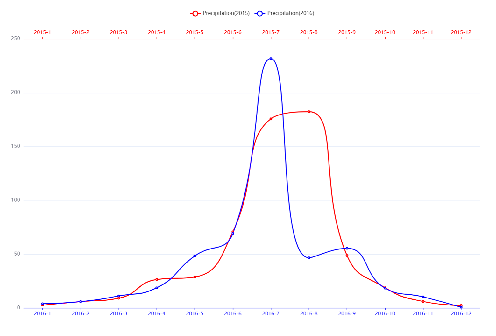


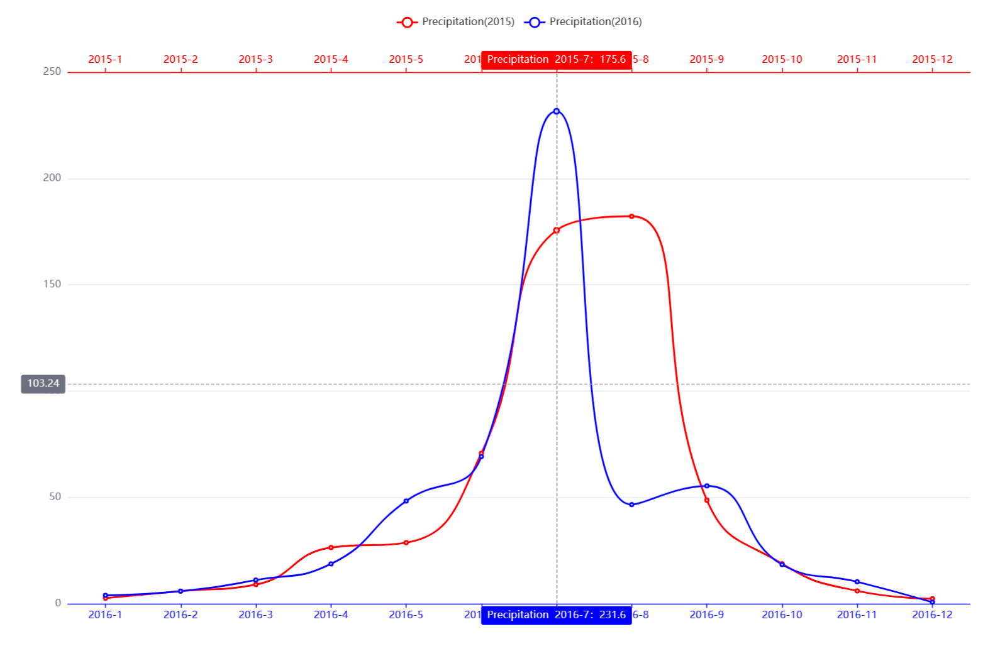


### 动态数据时间轴

```html
<html lang="en">
<head>
    <meta charset="UTF-8">
    <title>动态数据时间轴</title>

    <script src="./js/echarts.js"></script>

</head>

<style>
    #container {
        width: 70vw;
        height: 70vh;
        position: absolute;
        top: 50%;
        left: 50%;
        transform: translate(-50%, -50%);
    }
</style>
<body>
<div id="container"></div>
<script>
    //初始化echarts实例
    var chart = echarts.init(document.getElementById('container'));

    function randomData()
    {
        now = new Date(+now + oneDay);
        value = value + Math.random() * 21 - 10;
        return {
            name: now.toString(),
            value: [
                [now.getFullYear(), now.getMonth() + 1, now.getDate()].join('/'),
                Math.round(value)
            ]
        };
    }

    let data = [];
    let now = new Date(1997, 9, 3);
    let oneDay = 24 * 3600 * 1000;
    let value = Math.random() * 1000;
    for (var i = 0; i < 1000; i++)
    {
        data.push(randomData());
    }

    // 指定图表的配置项和数据
    var option =
        {
            title: {
                text: 'Dynamic Data & Time Axis'
            },
            tooltip: {
                trigger: 'axis',
                formatter: function (params)
                {
                    params = params[0];
                    var date = new Date(params.name);
                    return (
                        date.getDate() +
                        '/' +
                        (date.getMonth() + 1) +
                        '/' +
                        date.getFullYear() +
                        ' : ' +
                        params.value[1]
                    );
                },
                axisPointer: {
                    animation: false
                }
            },
            xAxis: {
                type: 'time',
                splitLine: {
                    show: false
                }
            },
            yAxis: {
                type: 'value',
                boundaryGap: [0, '100%'],
                splitLine: {
                    show: false
                }
            },
            series: [
                {
                    name: 'Fake Data',
                    type: 'line',
                    showSymbol: false,
                    data: data
                }
            ]
        };

    //使用刚指定的配置项和数据显示图表
    chart.setOption(option);

    setInterval(function ()
    {
        for (var i = 0; i < 5; i++)
        {
            //data.shift();
            data.push(randomData());
        }
        chart.setOption({
            series: [
                {
                    data: data
                }
            ]
        });
    }, 1000);

</script>

</body>
</html>
```


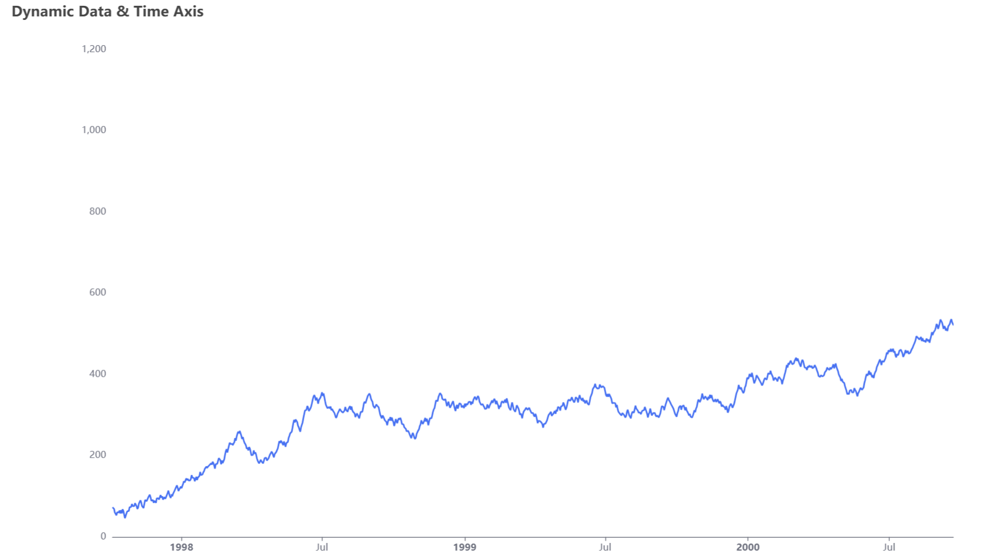


### 阶梯折线图

```html
<html lang="en">
<head>
    <meta charset="UTF-8">
    <title>阶梯折线图</title>

    <script src="./js/echarts.js"></script>

</head>

<style>
    #container {
        width: 70vw;
        height: 70vh;
        position: absolute;
        top: 50%;
        left: 50%;
        transform: translate(-50%, -50%);
    }
</style>
<body>
<div id="container"></div>
<script>
    //初始化echarts实例
    var chart = echarts.init(document.getElementById('container'));
    
    
    // 指定图表的配置项和数据
    var option =
        {
            title: {
                text: 'Step Line'
            },
            tooltip: {
                trigger: 'axis'
            },
            legend: {
                data: ['Step Start', 'Step Middle', 'Step End']
            },
            grid: {
                left: '3%',
                right: '4%',
                bottom: '3%',
                containLabel: true
            },
            toolbox: {
                feature: {
                    saveAsImage: {}
                }
            },
            xAxis: {
                type: 'category',
                data: ['Mon', 'Tue', 'Wed', 'Thu', 'Fri', 'Sat', 'Sun']
            },
            yAxis: {
                type: 'value'
            },
            series: [
                {
                    name: 'Step Start',
                    type: 'line',
                    step: 'start',
                    data: [120, 132, 101, 134, 90, 230, 210]
                },
                {
                    name: 'Step Middle',
                    type: 'line',
                    step: 'middle',
                    data: [220, 282, 201, 234, 290, 430, 410]
                },
                {
                    name: 'Step End',
                    type: 'line',
                    step: 'end',
                    data: [450, 432, 401, 454, 590, 530, 510]
                }
            ]
        };

    //使用刚指定的配置项和数据显示图表
    chart.setOption(option);


</script>

</body>
</html>
```


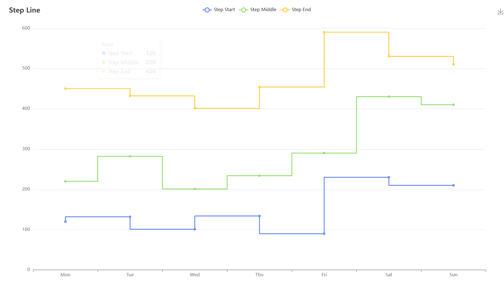


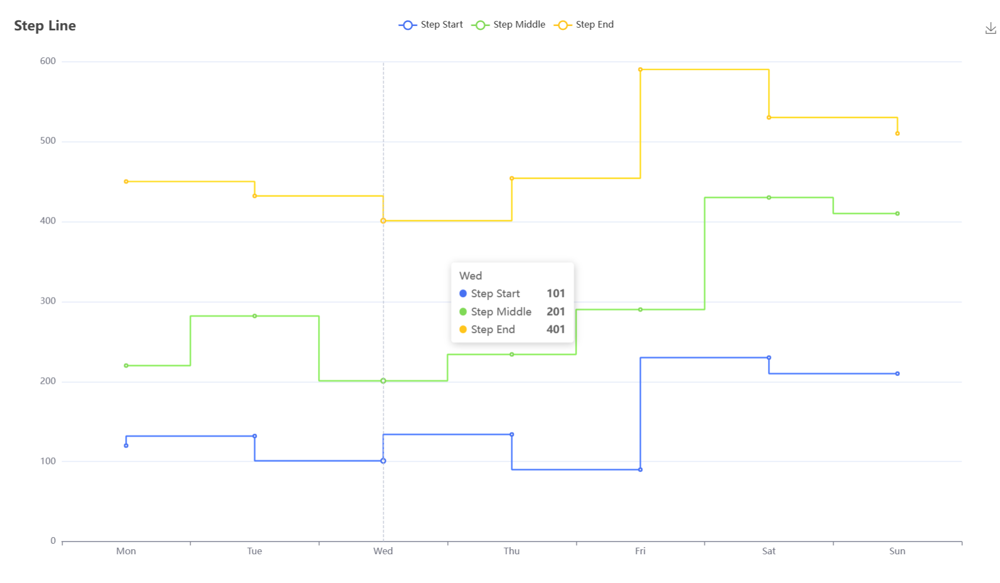


动态变化的数据

```html
<html lang="en">
<head>
    <meta charset="UTF-8">
    <title>阶梯折线图-动态</title>

    <script src="./js/echarts.js"></script>

</head>

<style>
    #container {
        width: 70vw;
        height: 70vh;
        position: absolute;
        top: 50%;
        left: 50%;
        transform: translate(-50%, -50%);
    }
</style>
<body>
<div id="container"></div>
<script>
    //初始化echarts实例
    var chart = echarts.init(document.getElementById('container'));

    var xData = [1, 2, 3, 4, 5, 6, 7];
    var data1 = [120, 132, 101, 134, 90, 230, 210];
    var data2 = [220, 282, 201, 234, 290, 430, 410];
    var data3 = [450, 432, 401, 454, 590, 530, 510];
    var index = 8;

    // 指定图表的配置项和数据
    var option =
        {
            title: {
                text: 'Step Line'
            },
            tooltip: {
                trigger: 'axis'
            },
            legend: {
                data: ['Step Start', 'Step Middle', 'Step End']
            },
            grid: {
                left: '3%',
                right: '4%',
                bottom: '3%',
                containLabel: true
            },
            toolbox: {
                feature: {
                    saveAsImage: {}
                }
            },
            xAxis: {
                type: 'category',
                data: xData
            },
            yAxis: {
                type: 'value'
            },
            series: [
                {
                    name: 'Step Start',
                    type: 'line',
                    step: 'start',
                    data: data1
                },
                {
                    name: 'Step Middle',
                    type: 'line',
                    step: 'middle',
                    data: data2
                },
                {
                    name: 'Step End',
                    type: 'line',
                    step: 'end',
                    data: data3
                }
            ]
        };

    //使用刚指定的配置项和数据显示图表
    chart.setOption(option);

    window.setInterval(function ()
    {
        xData.shift();
        xData.push(index++);
        data1.shift();
        data1.push(100 + Math.round(Math.random() * 200))
        data2.shift();
        data2.push(200 + Math.round(Math.random() * 200))
        data3.shift();
        data3.push(400 + Math.round(Math.random() * 200))

        chart.setOption({
            xAxis: {
                data: xData
            },
            series: [
                {
                    data: data1
                },
                {
                    data: data2
                },
                {
                    data: data3
                }
            ]
        })
    }, 2000)


</script>

</body>
</html>
```


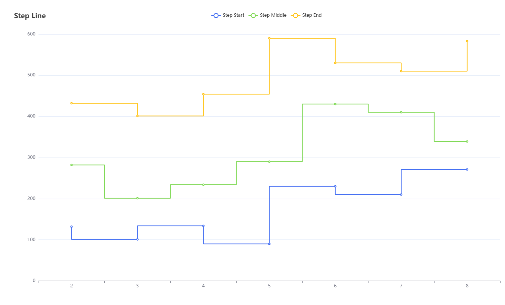


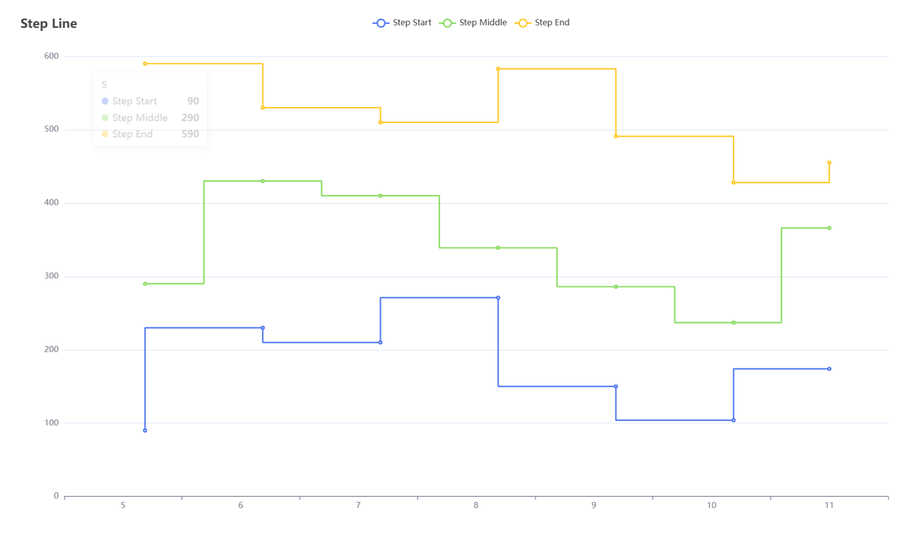


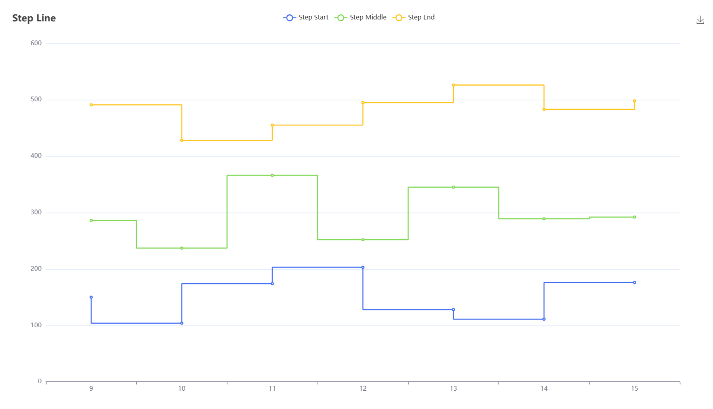


